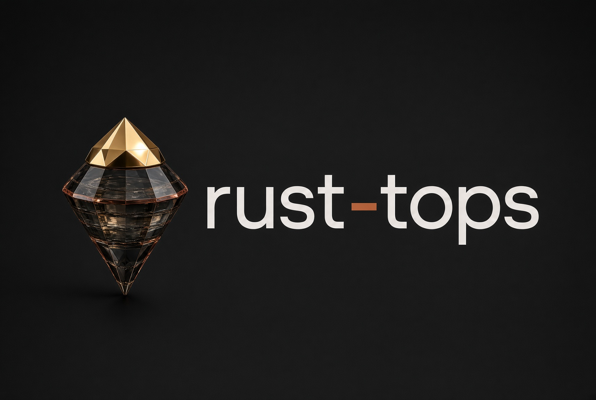

# Rust-TOPS

<p align="center">
  
</p>

<p align="center"><strong>A protocol and drop-in kit for Rust that is correct, dense, and fast.</strong><br/>
Spec, schema, class gates, and a thin orchestrator for the Cargo tools you already run.</p>

<p align="center">
  <a href="LICENSE"></a>
  <a href="https://crates.io/crates/cargo-tops"></a>
  <a href="https://github.com/Hedronite/rust-tops/actions/workflows/rust-tops.yml"></a>
</p>

<p align="center">
  <a href="#quick-start">Quick start</a> ·
  <a href="#what-you-get">What you get</a> ·
  <a href="#how-it-works">How it works</a> ·
  <a href="#status">Status</a> ·
  <a href="RUST_TOPS.md">Protocol</a> ·
  <a href="POLICIES.md">CI floor</a> ·
  <a href="laws/README.md">Bend2 pack</a> ·
  <a href="AGENTS.md">Harness</a>
</p>

<p align="center">
  Built by <a href="https://github.com/Hedronite">Hedronite</a>.<br/>
  CRAP scores use the 2007 Change Risk Anti-Patterns formula. This kit did not originate that metric.
</p>

---

Rust-TOPS (Rust Testing and Optimization Protocol Suite) is a protocol: a written spec, a JSON Schema, per-crate class floors, and the practice layer in [`POLICIES.md`](POLICIES.md). This repository is the public kit for adopting that protocol.

It is for Rust library and binary authors, and for the people who own their CI, who want one gate order: lint, tests, coverage, CRAP, mutation on the diff, then the extra layers the crate class names.

The Bend2 laws pack under [`laws/`](laws/) is provisional and non-normative. Protocol and its schema stay Bend-free. Package 0.1.3 ships the pack as an overlay.

## Pins

| Plane | Pin | Where |
| --- | --- | --- |
| Protocol | 1.0.0 | [`RUST_TOPS.md`](RUST_TOPS.md), [`schema/rust-tops.schema.json`](schema/rust-tops.schema.json) |
| Package | 0.1.3 | workspace [`Cargo.toml`](Cargo.toml), git tag `v0.1.3`, [crates.io](https://crates.io/crates/cargo-tops) |
| This package | edition 2021, MSRV 1.85 | [`Cargo.toml`](Cargo.toml); the `msrv` job uses Rust 1.85.0 |
| Crate page | 0.1.3 | [docs.rs/cargo-tops](https://docs.rs/cargo-tops) |
| Tool lock | rustc 1.91.0, cargo-crap 0.5.0, and the other pins in the file | [`rust-tops.lock`](rust-tops.lock) |

The tool lock is the version set used to evaluate gates. It is a different number from the MSRV. [`config/rust-tops.lock.example`](config/rust-tops.lock.example) is the same pin list, for copying into an adopting crate.

## Quick start

### Copy the files

```bash
cp config/rust-tops.example.yaml   ./rust-tops.yaml
cp config/rust-tops.lock.example   ./rust-tops.lock
cp AGENTS.md                       ./AGENTS.md
cp config/drop-in/clippy.toml      ./clippy.toml
cp config/drop-in/nextest.toml     ./.config/nextest.toml
cp config/drop-in/mutants.toml     ./.cargo/mutants.toml
cp config/drop-in/cargo-crap.toml  ./.cargo-crap.toml
cp config/drop-in/deny.toml        ./deny.toml
cp config/drop-in/rust-tops.yml    ./.github/workflows/rust-tops.yml
```

The example instance is a `parser-codec` sketch: edition 2024, MSRV 1.88. Replace `crate.class`, `crate.edition`, `crate.msrv`, coverage floors, `exemptions`, and `hot_paths`. The sample hot paths are not a file list of [`examples/parser-codec`](examples/parser-codec) (that fixture has `src/varint.rs` and no `src/frame.rs`).

In the workflow, replace `{MSRV}`, `{PRIMARY_PKG}`, `{SYSDEPS}`, and `{FFI_FEATURE}`. The copied workflow is a floor. See [`POLICIES.md`](POLICIES.md).

### Or install the orchestrator

```bash
cargo install cargo-tops
cargo tops init --class parser-codec
cargo tops check
cargo tops gate
```

`--class` accepts `library-core` (the default), `parser-codec`, `no-std-embedded`, `unsafe-kernel`, or `binary-cli`. `init` writes `rust-tops.yaml`, `AGENTS.md`, the drop-in configs, `.github/workflows/rust-tops.yml`, and `LAWS.bend`. It does not write `rust-tops.lock`. The generated instance still starts from the parser-codec example (edition 2024, MSRV 1.88). `LAWS.bend` is the provisional Bend pack.

`check` reads `rust-tops.yaml` and checks protocol id, a non-empty version, a crate name, `gates.crap.threshold_agent >= 1`, and that class `library-core` keeps `unexplained_survivors_max` at 0.

`gate` runs enabled layers at or below `--max-tier` (default 1). `--dry-run` prints the commands and does not run them. A mapped tool missing from `PATH` fails the gate.

### Nix

```nix
{
  inputs.rust-tops.url = "github:Hedronite/rust-tops";
  outputs = { nixpkgs, rust-tops, ... }:
    let
      pkgs = import nixpkgs {
        system = "aarch64-darwin";
        overlays = [ rust-tops.overlays.default ];
      };
    in {
      packages.aarch64-darwin.default = pkgs.cargo-tops;
      # pkgs.rust-tops-laws -> $out/share/rust-tops/laws
    };
}
```

`overlays.default` exposes `cargo-tops` and `rust-tops-laws`. Flake systems are `aarch64-darwin`, `x86_64-darwin`, `aarch64-linux`, and `x86_64-linux`. Intel macOS follows input `nixpkgs-darwin-x64` (`nixpkgs-26.05-darwin`). The other systems follow `nixos-unstable`. `devShells.default` includes `cargo-tops`, `rustc`, `cargo`, `clippy`, and `rustfmt`.

```bash
nix flake check
./scripts/bend-gate.sh
```

`nix flake check` builds both packages and runs the law catalog in names-only mode. `bend-gate.sh` checks that [`laws/LAWS.bend`](laws/LAWS.bend) and [`laws/PROOF.bend`](laws/PROOF.bend) name every row in [`laws/NAMES`](laws/NAMES). It runs `bend` when that binary is on `PATH`.

## What you get

| | Cargo alone | This kit |
| --- | --- | --- |
| Contract | Docs and tests you arrange | Protocol 1.0.0 and a draft 2020-12 JSON Schema |
| Class floors | None | Five profile files; the schema allows eleven class names |
| Drop-in configs | None | clippy, nextest, mutants, cargo-crap, cargo-deny, GitHub Actions floor |
| Orchestrator | You sequence the commands | `cargo tops init`, `check`, and `gate` |
| CI on this repo | — | `fmt-clippy-deny`, `nextest`, `msrv`, `feature-matrix`, `coverage-crap` |
| CRAP config | — | [`.cargo-crap.toml`](.cargo-crap.toml): threshold `6.0`; excludes `src/generated/**`, `tests/**`, `benches/**`, `examples/**` |
| Bend2 | — | Provisional pack, laws H-01 through H-53 |
| Nix | — | Overlay and packages `cargo-tops`, `rust-tops-laws` |

### What you do not get

| Claim | Reality |
| --- | --- |
| A test engine | `cargo-tops` shells out to `cargo fmt`, Clippy, nextest, `cargo llvm-cov`, `cargo-crap`, `cargo-mutants`, and `cargo-deny`. |
| JSON Schema validation from `cargo tops check` | That command is the typed check in the quick start. Point a draft 2020-12 validator at [`schema/rust-tops.schema.json`](schema/rust-tops.schema.json) to check an instance. |
| Fuzz, Miri, Kani, loom, sanitizers, or Callgrind from `cargo tops gate` | Those layer ids have no command mapping. The gate prints `skip` and continues. |
| Mutants, Darwin, or fuzz jobs in this repo | They are comments in [`.github/workflows/rust-tops.yml`](.github/workflows/rust-tops.yml). The feature matrix checks `cargo-tops` and `parser-codec` with `--no-default-features`, and `no-std-embedded` both with `--no-default-features` and with `--features std`. |
| Bend2 as protocol 1.0 | The pack is provisional. The schema has no Bend fields. Hard rows encode as `Refuse`; soft rows as `Ack`. Catalog: [`BEND2-INTEGRATION.md`](BEND2-INTEGRATION.md). |
| A Bend proof on every `bend-gate.sh` run | With no `bend` on `PATH`, the script reports the name check and exits 0. |
| `cargo tops init` for every schema class | The CLI classes are the five named above. The schema also lists `library-util`, `binary-service`, `concurrency-runtime`, `ffi-bridge`, `proc-macro`, and `workspace-root`. Those six have no profile file and no `--class` value. |
| Published example crates | [`examples/parser-codec`](examples/parser-codec) and [`examples/no-std-embedded`](examples/no-std-embedded) set `publish = false`. |
| A written gate report | [`schema/gate-report.schema.json`](schema/gate-report.schema.json) describes an optional report object. The CLI prints text and does not write that object. |

## How it works

Write the oracle from the contract, then the smallest production code that meets it. A test taken from the function body freezes current behavior, including bugs. Splitting a function only to lower its CRAP score violates the spec's scar-guard.

Order for a gated change, from [`RUST_TOPS.md`](RUST_TOPS.md):

1. `cargo fmt`, Clippy with `-D warnings`, `cargo deny check`.
2. `cargo nextest` (profile `ci`) and `cargo test --doc`.
3. `cargo llvm-cov` writing LCOV, then `test -s` on that file.
4. `cargo crap --lcov` against that LCOV. The drop-in threshold is 6.0. Pass `--lcov` on the CLI. `fail = true` is not a cargo-crap config field.
5. `cargo mutants --in-diff`. The gate diffs `origin/main...HEAD`.
6. Property tests, fuzz, Miri, Kani, and Callgrind when the crate class requires them. `cargo tops gate` has no commands for this step.

The protocol cap for new human-authored code is CRAP 4. The cap for new code written by a coding agent is CRAP 6. A class table can set other numbers: [`profiles/binary-cli.yaml`](profiles/binary-cli.yaml) uses human 6 and agent 8. Coverage floors live in `rust-tops.yaml`. The drop-in workflow does not pass `--fail-under-lines`.

| Path | Role |
| --- | --- |
| [`RUST_TOPS.md`](RUST_TOPS.md) | Normative protocol 1.0.0 |
| [`schema/`](schema/) | Draft 2020-12 schema for an instance, and a separate optional gate-report schema |
| [`POLICIES.md`](POLICIES.md) | CI floor and the checks harvested from applying the protocol |
| [`config/rust-tops.example.yaml`](config/rust-tops.example.yaml) | Example `parser-codec` instance |
| [`config/drop-in/`](config/drop-in/) | Files to copy into an adopting crate |
| [`profiles/`](profiles/) | `library-core`, `parser-codec`, `binary-cli`, `no-std-embedded`, `unsafe-kernel` |
| [`crates/cargo-tops`](crates/cargo-tops) | The `cargo-tops` binary. Published templates live in `crates/cargo-tops/templates/` |
| [`examples/`](examples/) | Fixtures: a small frame and varint codec, and a `no_std` ring buffer |
| [`AGENTS.md`](AGENTS.md) | Harness for coding agents editing a crate under the protocol |
| [`BEND2-INTEGRATION.md`](BEND2-INTEGRATION.md) | Candidate laws. Provisional. Outside the 1.0 spec |
| [`laws/`](laws/) | `LAWS.bend`, `PROOF.bend`, `NAMES` (H-01..H-53) |
| [`flake.nix`](flake.nix) | Nix overlay |
| [`CHANGELOG.md`](CHANGELOG.md) | Package history. Protocol 1.0.0 and package 0.1.3 are separate version planes |

## Status

`main` and git tag `v0.1.3` are package **0.1.3**, which is also the crates.io release. Protocol **1.0.0** stayed put on that tag.

This repository's workflow runs format and Clippy, `cargo deny`, nextest, doc tests, an MSRV check on 1.85.0, the feature matrix above, and a coverage job that fails when `lcov.info` or the CRAP JSON is empty. The workspace lint `unsafe_code = "forbid"` applies to `cargo-tops` and both fixtures.

The Bend2 pack in this tag is 53 laws. [`scripts/bend-gate.sh`](scripts/bend-gate.sh) always checks names. A `bend` proof runs only when `bend` is on `PATH`. Moving a law into [`RUST_TOPS.md`](RUST_TOPS.md) takes an explicit spec bump.

Current limits:

- `cargo tops gate` runs the mapped commands through tier 1.
- `cargo tops init` covers five classes. The other six names exist in the schema and the spec table.
- `bend-gate.sh` exits 0 when `bend` is absent.
- Flake support for `x86_64-darwin` tracks `nixpkgs-26.05-darwin`, because the `nixos-unstable` pin dropped Intel macOS.

## Contributing

Read [`RUST_TOPS.md`](RUST_TOPS.md) and [`schema/rust-tops.schema.json`](schema/rust-tops.schema.json) before changing a gate. When prose and schema disagree, fix the schema, then the prose.

[`POLICIES.md`](POLICIES.md) is the CI floor. [`AGENTS.md`](AGENTS.md) is the editing harness. Bend2 work starts at [`laws/README.md`](laws/README.md) and [`BEND2-INTEGRATION.md`](BEND2-INTEGRATION.md). Leave a law as written; do not weaken it so a proof passes.

Package history is [`CHANGELOG.md`](CHANGELOG.md).

## Credits and license

Built by Hedronite. Licensed under MIT OR Apache-2.0, at your option. See [`LICENSE`](LICENSE), [`LICENSE-MIT`](LICENSE-MIT), and [`LICENSE-APACHE`](LICENSE-APACHE).

The CRAP formula is Change Risk Anti-Patterns (2007), cited in [`RUST_TOPS.md`](RUST_TOPS.md). Names such as `cargo-llvm-cov`, `cargo-mutants`, `cargo-crap`, nextest, and `cargo-deny` refer to those tools.
